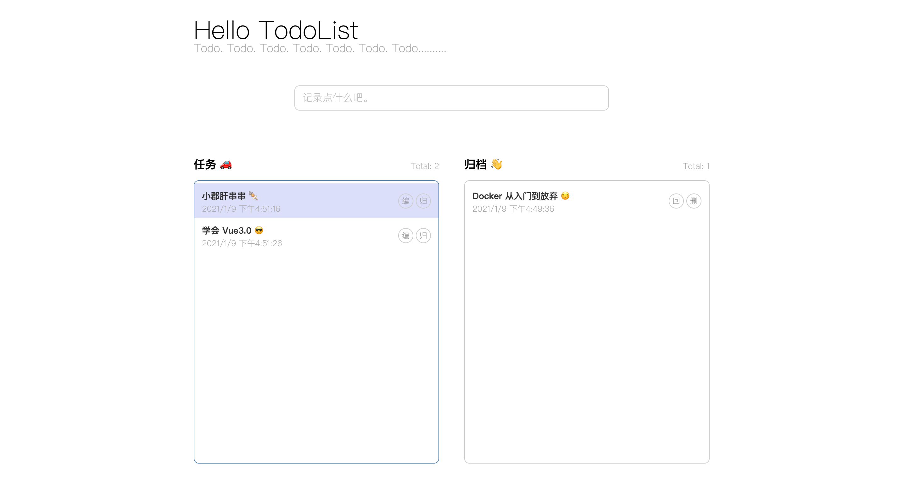

# vue3-todolist

> 基于 Vue3 + Typescript + CompositionApi 实现的 TodoList

这是一个 Vue3 的学习项目，尤其是使用 Composition Api 分割 [Item 组件](https://github.com/cuizhichen/Vue3-TodoList/blob/master/src/pages/Home/components/Item.vue)业务逻辑部分，适合第一次接触 Vue3 的同学享用。

#### 特征

1. 使用 Vue3 新特性
2. 简单封装 useQuery 和 useMutation hooks，方便请求的发送
3. 模拟后端数据返回
4. 极致的页面交互

演示图片

